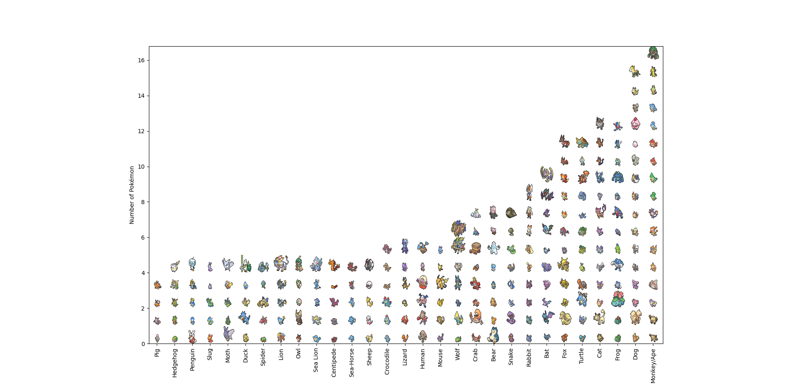

# Pokémon Origins

I've always wondered how many cat, bats, dogs or other type of a recurring animal based pokémon were there, so I did this graph to visualize it. 

It certainly isn't the most accurate (since it's hard to categorize some pokémons and many were forgotten, so you can add always an issue for me to update it), but it already shows some interesting information.

## Data

Classification data is saved in a [Google Sheets](https://docs.google.com/spreadsheets/d/196M6nG9C7Ge7w3DcWK7KlOum3fIIgEGiwbLS1XDphYk/edit) sheet that is retrieved as `data.csv` for the Python script to parse and plot.

Pokémon sprites are retrieved from [Pokémon DB](https://pokemondb.net/sprites) using a [web scrapper](retrieve_icons.py).

## Example

